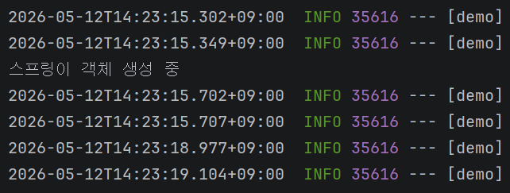

# week6

### 객체 생성부터 관리

- 클래스를 스프링 빈으로 관리
    - 클래스를 스프링 빈으로 등록
    - 클래스를 **객체로 생성해서 스프링 빈으로** 등록
1. @Component 
    - 클래스 위에 달아서 사용
    
    ```java
    package com.example.demo;
    
    import org.springframework.stereotype.Component;
    
    @Component
    public class ProductController {
        // 상품 조회, 상품 등록 담당
    
        ProductController() {
            System.out.println("스프링이 객체 생성 중");
        }
    }
    ```
    
    
    
2. @Configuration + @Bean
    
    (추후 스터디)
    

### Apache tomcat


- Tomcat initialized with port 8080 (http)
    - port (= 항구) : 8080
        - 원하는 서비스마다 번호 지어주고, 번호에 맞게 찾아오라고 안내
- Apache tomcat
    - 웹 서버
    - tomcat = 인터넷 세상에서 **공간을 만들어** 주는 아이
    - 내 컴퓨터에서 ‘공간’을 만들었다.
    - 공간은 주소를 알려주면 찾아올 수 있다!
        - 주소 = http://localhost:8080

### @Controller

- annotation 사용해서 컨트롤러 역할 부여


- @Controller : @Component 포함하고 있음
    - AnnotatedHandlerMethod랑 조합해서 사용됨
        - RequestMapping이 Annotated 해주고 있음
    - To 스프링 : 클래스를 스프링 빈으로 등록하고, 컨트롤러로 사용할 거야.
    - 사용법 : @RequestMapping
        - HandlerMethod
- 핸들러(handler) : 사용자의 요청에 의해 자동으로 호출되는 **메소드**
    
    ↔ 일반 메소드 : 개발자의 요청에 의해 호출됨