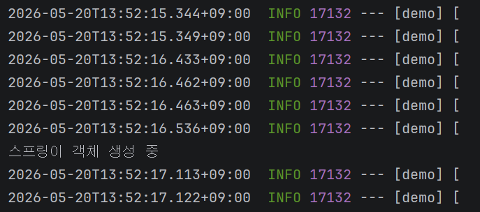

# week7

### RequestMapping

- 핸들러 메소드 만들어야 하는 상황
    - 핸들러 메소드가 되게 도와주는 것 = `@RequestMapping`
    - 메소드를 개발자가 아니라 사용자에 의해 호출되도록
- 사용자의 요청이 날아오면 **메소드를 호출**하는 것
    - 사용자가 요청 → 상품 이름 조회
    - `localhost:8080`이라고 요청이 오면 이 메소드 호출
        
        ```java
        @RequestMapping
            public String getProduct() {
                return "NoteBook";
            }
        ```
        

### HTTP request

- 📮 Request ↔ 📩 Response
    - URL [주소]
    - Method [목적] ex. 조회, 삽입, 수정 …
        - CRUD
        1. 데이터 조회 : GET
        2. 등록/생성/삽입 : POST
        3. 수정 : PUT (전체) / PATCH (부분)
        4. 삭제 : DELETE
    
    ```java
    @RequestMapping(value = "http:localhost:8080", method = RequestMethod.GET)
        public String getProduct() {
            return "NoteBook";
        }
    ```
    
    
    

### 최신 웹 개발 @RestController

- 최신 백엔드 역할을 하는 컨트롤러 = `@RestController`
    - HTTP 규칙을 잘 지키는 컨트롤러
    
    
    
    - 컨트롤러랑 응답 본문을 한번에 사용할 수 있음
    - 옛날 컨트롤러 + 최신식 REST API를 만들 수 있게 도와주는 `@ResponseBody`

### HTTP

- 📩 Response
    - Body : 데이터 담아두는 곳
    
    ```java
    @Controller
    @ResponseBody
    public class ProductController {
        // 상품 조회, 상품 등록 담당
    
        ProductController() {
            System.out.println("스프링이 객체 생성 중");
        }
    
        @RequestMapping(value = "", method = RequestMethod.GET)
        public String getProduct() {
            return "NoteBook";
        }
    }
    ```
    
    - 컨트롤러이면서 ResponseBody에 데이터를 담아서 보낸준다는 의미
    
    
    
    