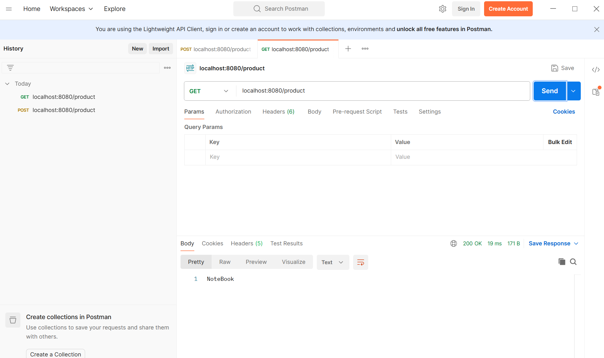
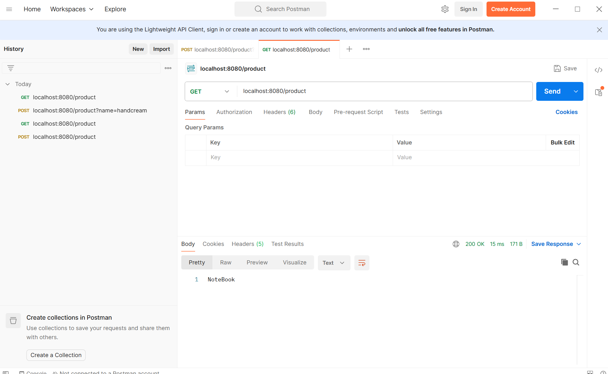
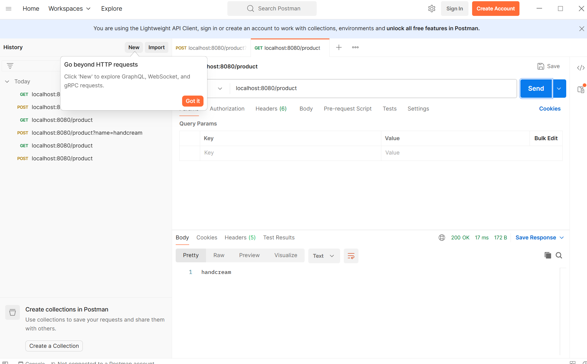
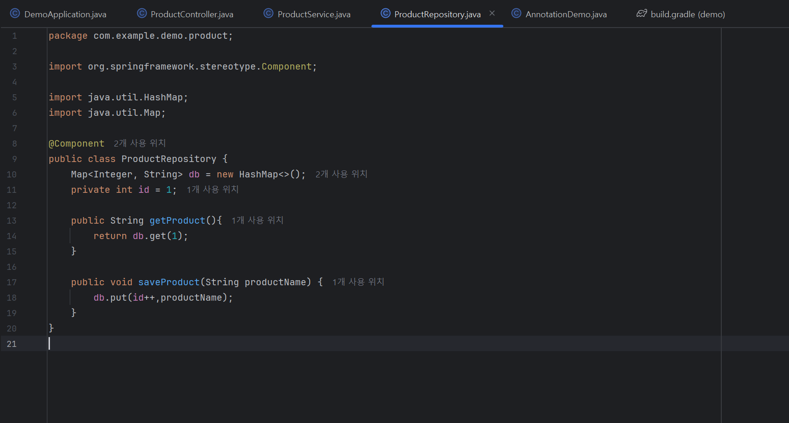
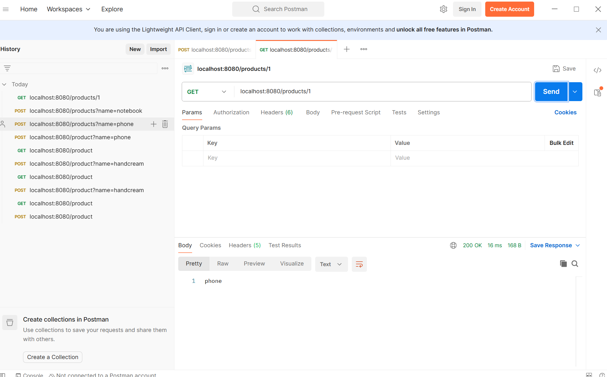
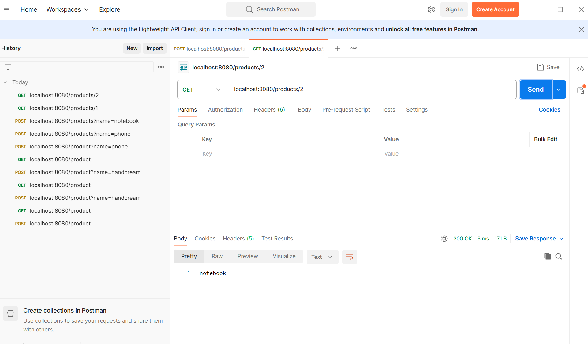

HTTP Method
Request
-URL
-Method(목적)
-Body: POST, PUT....
1. 조회: GET
2. 등록/생성/삽입: POST
3. 수정: (전체)PUT/(부분)PATCH
4. 삭제: DELETE

요청할 때 데이터도 같이 줄 수 있는 방법
1. 주소에 데이터를 받아오는 방법 "쿼리스트링"
 http://localhost:8080/products?name=_______
 
 
 *DB에 여러개 저장하고 싶음
 
 
 2. 주소에 데이터를 받아오는 방법 "Path Variable"
  http://localhost:8080/products/{id}
  
  