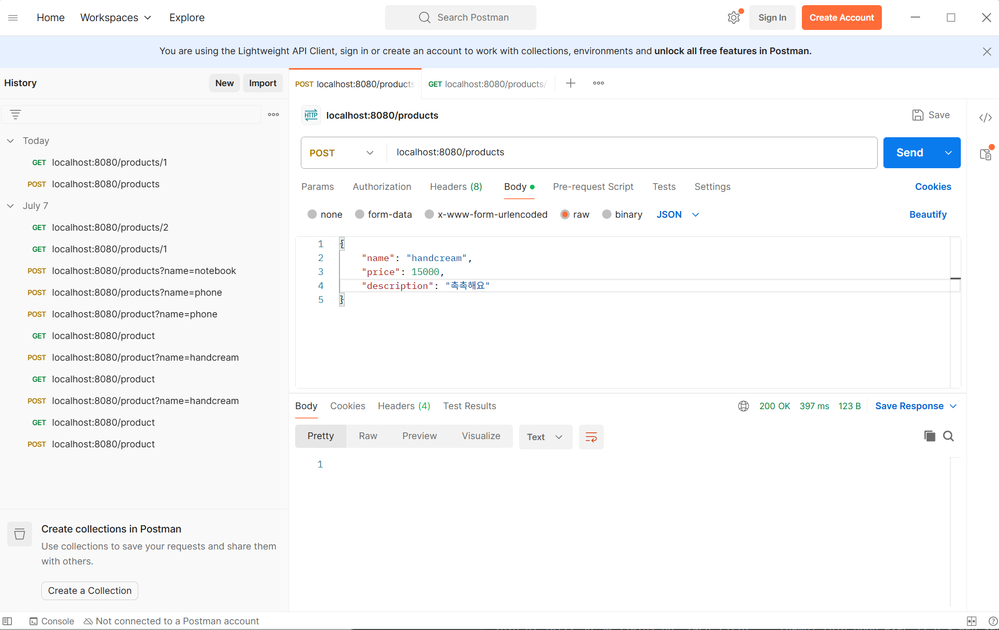
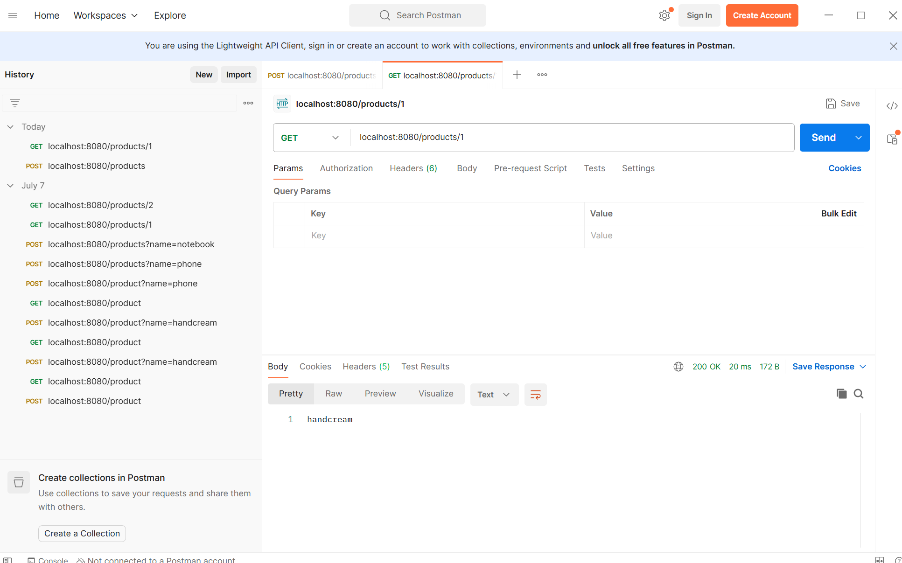
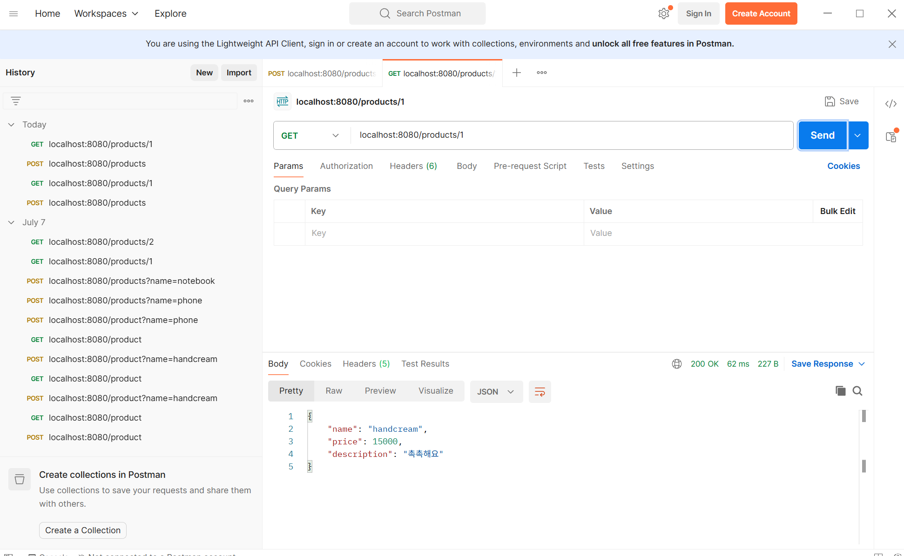

요철할 때 데이터도 같이 줄 수 있는 방법
3. body에 데이터를 받아오는 방법"RequestBody"
JSON으로 값을 보냄

JSON
-데이터 형태
 JavaScript Object Notation
 var product = {
    name: "handcream",
    price: 15000,
    description: "촉촉해요"
 }

 product.name
 product.price

 
 

 JSON 형태
 

 @Compoment 진화
 @Controller
 @Service: @Component + ;;;
 @Repository: @Component + DB 기본 예외 처리